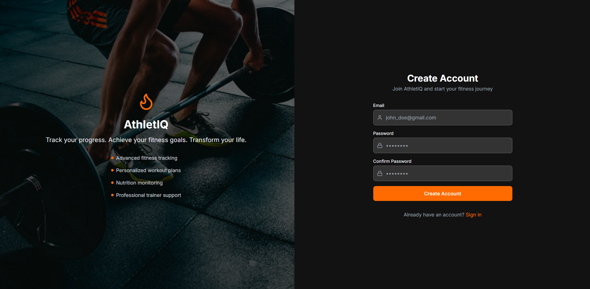
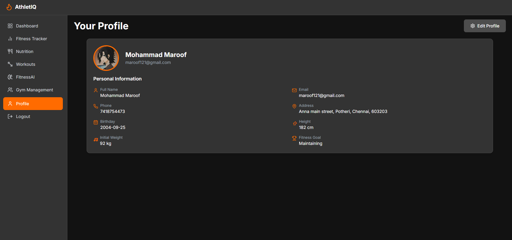
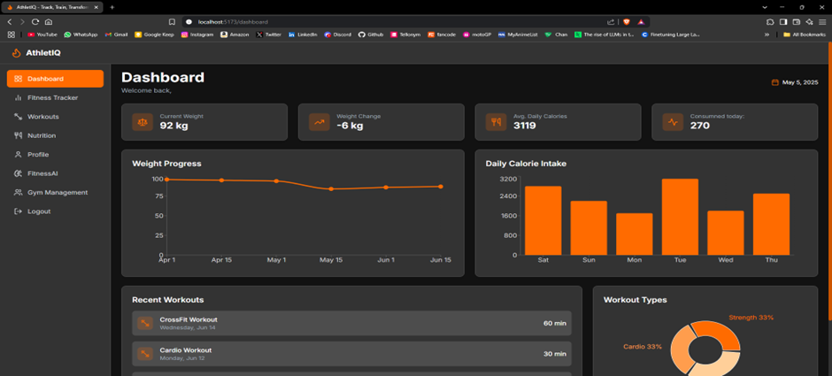
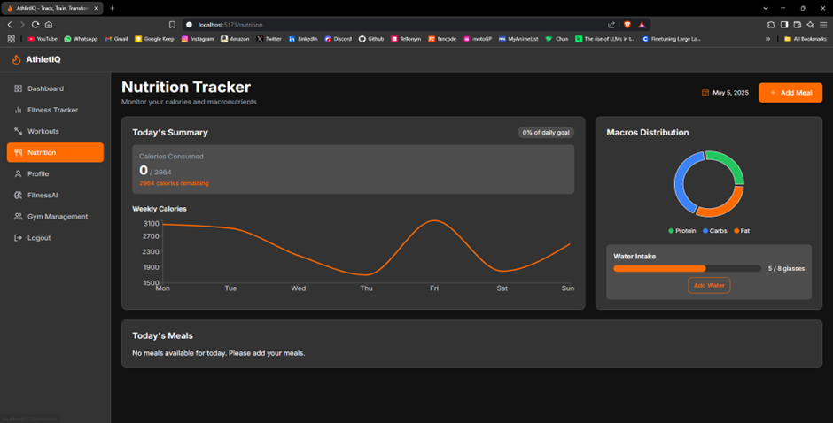
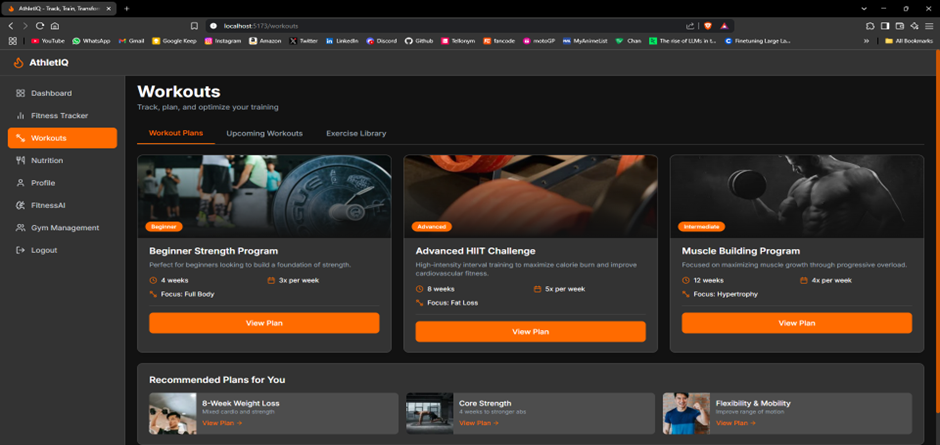
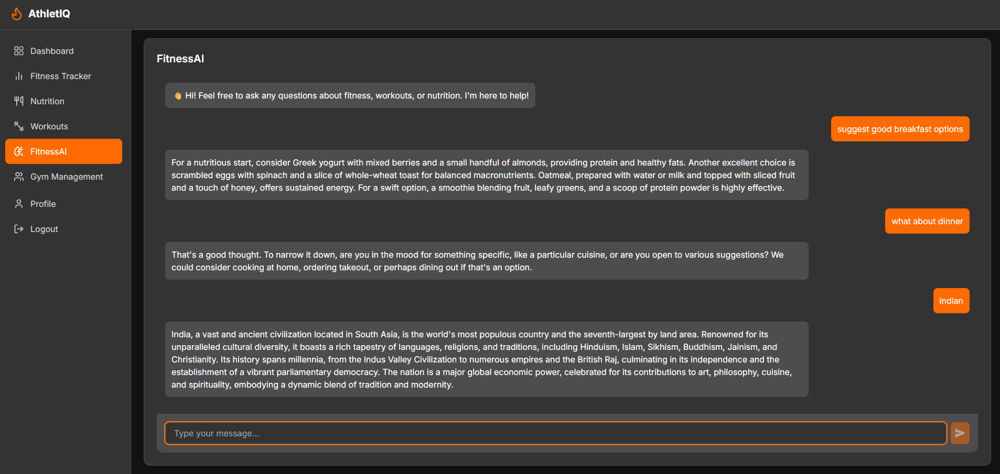

# AthletIQ – Fitness & Nutrition Tracker 🚀

A full‑stack fitness and gym management platform built with the PERN stack. It enables users to track workouts, calories, and progress, while allowing gym owners to manage memberships, plans, and attendance. The app includes secure authentication and real‑time data visualization.

**Live Demo**: [https://athletiq‑kbef.onrender.com](https://athletiq‑kbef.onrender.com)

---

## 📷 Screenshots

| Authentication Page                                            | Profile                                                             | Dashboard                                                             |
| -------------------------------------------------------------- | ------------------------------------------------------------------- | --------------------------------------------------------------------- |
|  |  |  |

| Nutrition Tracker                                                     | Workout                                                               | Fitness AI                                                            |
| --------------------------------------------------------------------- | --------------------------------------------------------------------- | --------------------------------------------------------------------- |
|  |  |  |

## 🧩 Tech Stack

**Frontend:**

- React.js + Vite
- Tailwind CSS (UI Styling)
- Recharts (Data Visualization)
- Framer Motion (Animations)

**Backend:**

- Node.js & Express.js
- PostgreSQL (Database)
- JWT Authentication

**Others:**

- Git & GitHub (Version Control)
- Insomnia (API Testing)
- Figma (UI/UX Design)

---

## 📂 Project Structure

```
├─ client/                 # Front‑end (React + Vite)
├─ server/                 # Back‑end (Node, Express, PostgreSQL)
├─ .gitignore
└─ README.md
```

---

## ✅ Key Features

- Secure user authentication (login + signup)
- Personalized dashboard to view fitness progress
- Workout tracking: log exercises, sets, reps, weights
- Meal logging: add meals with calorie & macronutrient breakdown
- Calorie & macro tracker: calculates optimal intake based on user stats
- Progress charts: visualize weight, calorie consumption, performance trends
- Gym management: create or join gyms, manage memberships & plans

---

## 🧭 Roadmap & Future Enhancements

- Comments & community interactions on workouts and meals
- Tags/categories + advanced search/sort for workouts and meals
- Theme switcher (dark/light mode)
- Mobile‑first improvements, potentially PWA experience
- CI/CD pipeline, automated tests, code linting/enforcement
- Googlel login option
- Bug‑reporting button (e.g., via Sentry)

---

## 🛠 Getting Started

1. Clone the repository
   git clone https://github.com/mmaroof487/AthletIQ.git
   cd AthletIQ

2. Backend setup
   cd server
   npm install
   npm run dev

3. Frontend setup
   cd ../client
   npm install
   npm run dev

4. Database setup
   - Create a PostgreSQL database
   - Update connection details in server/db/client.js
   - Run any migrations if included

---
